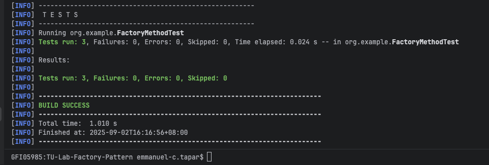

# Factory Implementation
## By Emmanuel Christian N. Tapar

### Part 1: Rigid Notification System

1. Output
    
   > Notification sent successfully shown in the console output.
   
### Part 2: Notification System using Factory Method Pattern

1. Output
    
   > Notification sent successfully shown in the console output.
   
2. Testing Notification System using Factory Method Pattern
    
   > All test cases passed successfully, confirming the Factory Method Pattern implementation is correct.